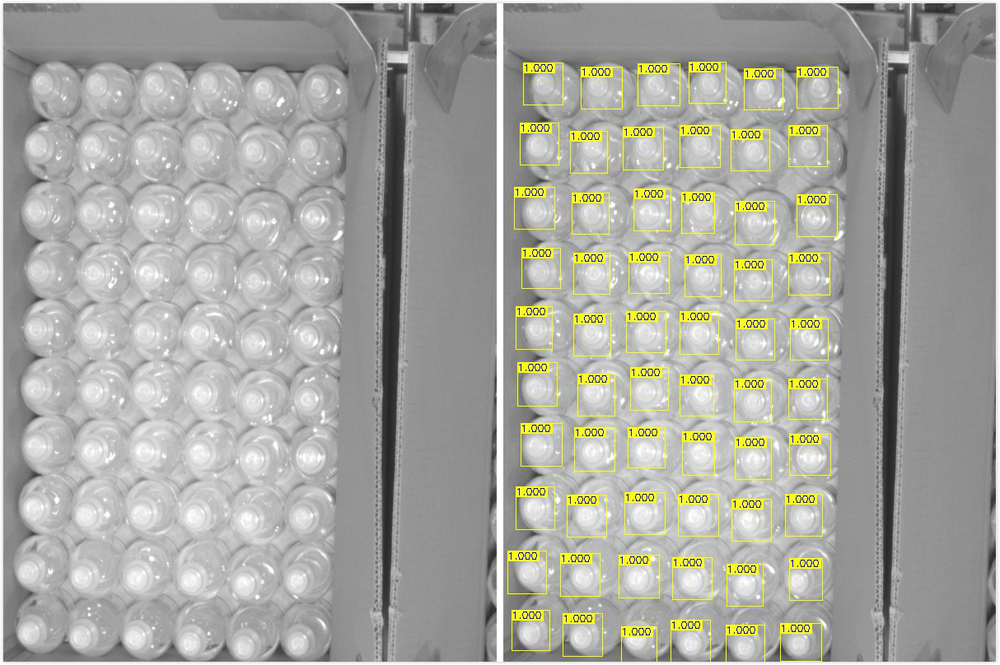
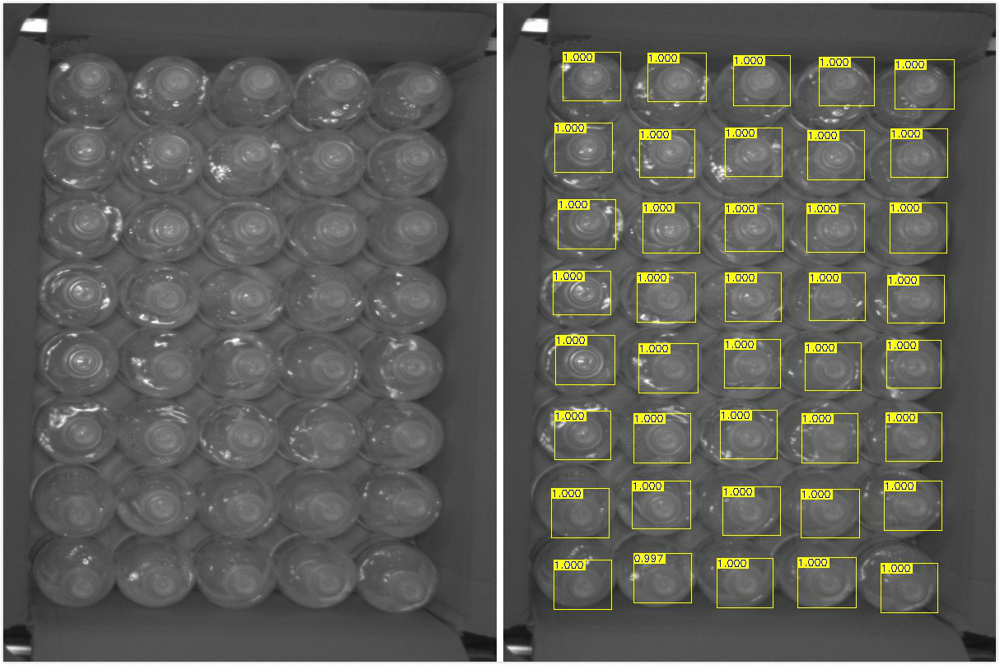
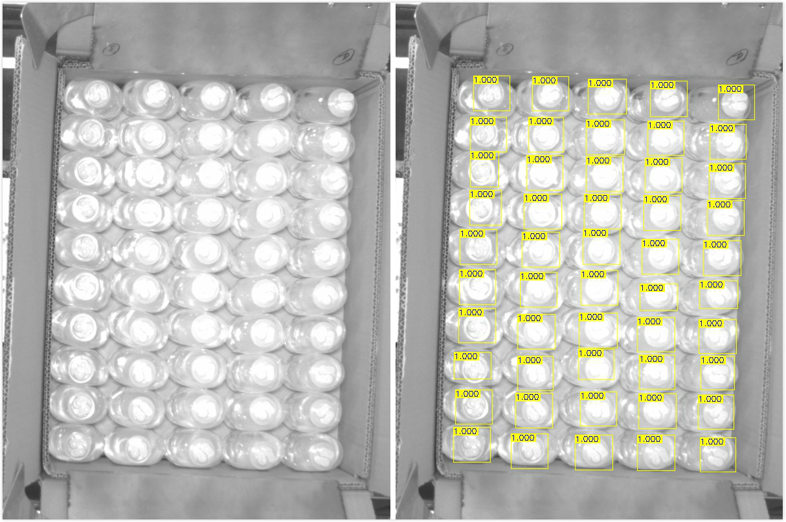
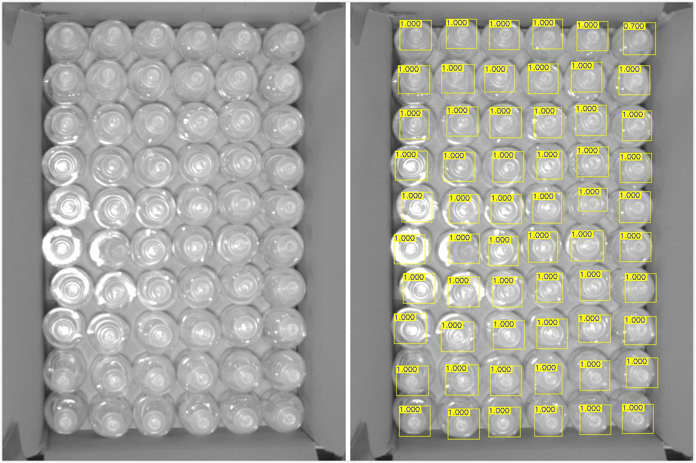

# Counter_v2.0

  采用基于mobilenetv2_ssd的目标检测模型对箱装输液瓶进行计数。

## Composition

  Counter_v2.0

* `dataset_ops`: 一些数据集处理运算(包括生成tfrecords文件、目标检测数据集制作、预处理等.
* `detection_ops`: 目标检测模型相关组件(根据tensorflow object_detection API 修改).
* `mobilenet`: mobilenet_v2 模型.
* `examples`: 示例图片及输出结果.
* `mobilenet_v2_eval.py`: mobilenet_v2 评估.
* `mobilenet_v2_train.py`: mobilenet_v2 训练.
* `loss_op.py`: 定义损失函数的运算.
* `ssd_mobilenetv2_ppn.py`: 模型训练.
* `process_op.py`: 一些模型预处理和后处理图运算.
* `test_utils.py`: .pb模型文件生成、读取以及一些模型测试组件.
* `test.py`: 最终的测试模型文件.
* `counter_model.py`: 与counter_v1相结合的模型.
* `README.md`

## Performance

一些检测结果:

 
 
 
 

## Dataset
* [counter_v2_model.pb](https://github.com/qianguzi/Counter_v2.0/releases/download/v2.0/counter_v2_model.ckpt.tar.xz): pb 模型文件.

* [counter_v2_model.ckpt.tar.xz](https://github.com/qianguzi/Counter_v2.0/releases/download/v2.0/counter_v2_model.pb): ckpt 模型文件.

* [counter_v2_tfrecord.tar.xz](https://github.com/qianguzi/Counter_v2.0/releases/download/v2.0/counter_v2_tfrecord.tar.xz): tfrecords 训练数据.

* [detection_dataset.tar.xz](https://github.com/qianguzi/Counter_v2.0/releases/download/v2.0/detection_dataset.tar.xz): 自己制作的检测数据集.

* [original_dataset.zip](https://github.com/qianguzi/Counter_v2.0/releases/download/v2.0/original_datase.zip): 原始图片数据.

## References

1. **Tensorflow Object Detection API** [[link]](https://github.com/tensorflow/models/tree/master/research/object_detection#tensorflow-object-detection-api). Google.

2. **MobileNetV2: Inverted Residuals and Linear Bottlenecks** 
    Mark Sandler, Andrew Howard, Menglong Zhu, Andrey Zhmoginov, Liang-Chieh Chen 
    [[link]](https://arxiv.org/abs/1801.04381). In CVPR, 2018.